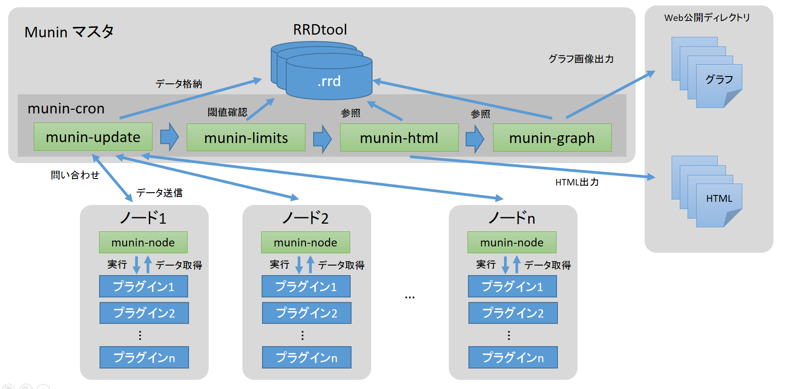

.. -*- coding: utf-8 -*-

=======================================
Munin のアーキテクチャ
=======================================

.. sidebar:: 目次

   .. contents:: 
       :depth: 3
       :local:

.. _munin-architecture:

クライアント・サーバ型
==============================

Munin はクライアント・サーバ型です。

* Munin マスタ（サーバ） … 定期的にノードにアクセス・データを収集し、ローカルの RRDtool に格納します。また、ユーザが参照するためのリソース・グラフや HTML ファイルを生成します。
* Munin クライアント（ノード）… 監視対象のサーバ上で常駐するデーモンです。サーバからデータの要求があれば、ノード内で定義している情報をプラグインを通して取得します。そして、その結果をサーバに返します。

Munin は単純な RRDtool のラッパーでではありません。Munin はクライアント・サーバ型の構成です。Munin のシンプルな構成は、KISS(Keep it simple, stupid) [#kiss]_ の設計思想に基づいて開発されており、役割毎にモジュールが分割されています。

Munin マスタ
====================

Muninマスタは、Muninに関する全てを中心的に処理する役割があります。複数のMuninノードと通信を行い、取得した様々な値をRRD形式のファイルに格納します。RRD(Round Robin Database)形式は、RRDtool (http://oss.oetiker.ch/rrdtool/)が時系列でデータを扱う形式です。一度ファイルを作成すると容量が増えない利点があり、Muninのような長期間のデータを扱う監視ツールのグラフ化ツールとして広く採用されています。

マスタはノードから値を取得し、その値が閾値（warningまたはcriticalを指定可）を超えていないかどうか確認します。値が設定値を超過している場合は、メール等で通知することもできます。更に、グラフ画像ややHTMLファイルを生成します。このとき、監視対象が多くなると画像やファイル生成はサーバの負荷になりがちなため、動的に生成する方法を選ぶこともできます。

マスタを構成するツール群は以下の通りです。

* ``munin-cron``   … cron で実行されるシェル・スクリプトで、munin-update、munin-limits、munin-html、munin-graphの各スクリプトを実行します。データ収集や、HTMLページや画像生成のタイミングは、|このmunin-cronの実行に依存しますが、個々のスクリプトの手動実行も可能です。
* ``munin-update`` … Muninノードからデータ収集を行い、RRD形式のファイルにデータを格納します。
* ``|munin-limits`` … RRDファイルに格納されている値を評価します。正常時は「OK」ですが、値を超過すると「warn」か「crit」と判定します。この結果を、メールや Nagios と連携して通知できます。 
* ``|munin-html`` … ユーザが参照する画面のHTMLページを生成します。
* ``|munin-graph`` … ユーザが参照する画面のグラフ画像を生成します。
* ``munin-cgi-html`` … ユーザがページを表示する度に、HTMLページを都度生成します（オプション）。
* ``munin-cgi-graph`` … ユーザがページを参照する度に、グラフ画像を都度生成します（オプション）。                                          |

マスタを構成する要素はPerlで書かれたスクリプトです。実行する度に設定ファイル ``/etc/munin/munin.conf`` または ``/etc/munin/munin.conf.d/`` 以下に設置する設定ファイルを参照します。

Munin ノード
====================

Muninノードは、監視対象のホスト上で動作するエージェントです。エージェントはMuninマスタからデータ収集のリクエストを待ち受けます。マスタからアクセスを受け、必要に応じて都度プラグインを実行し、得られた値をアイテムとしてマスタに返す働きをします。このマスタとノードの通信は、標準ではポート4949(TCP)を使用しますが、任意のポートを指定できます。また、ノードは複数のマスタと通信することも可能です。セキュリティ対策として、接続可能なマスタをIPアドレスかネットワーク単位（CIDR）で制限する機能も持っています。

通信時には独自のプロトコルを使っています。テキスト形式のプロトコルのため、 ``nc`` コマンドや``telnet`` 等のコマンドを使えば、手動でノードにアクセスできるため、簡単な動作テストやデバッグに使うこともできます。

以下は ``nc`` コマンドを使い、 munin-node というノード用のエージェントから、直接ロード・アベレージの値を取得しています。ローカルホスト上で動作する munin-node にポート4949（TCP）で接続し、バージョン情報の表示(VERSION)、プラグインが返すデータ一覧の表示（LIST）、ロード・アベレージの取得（FETCH load）の各コマンドを実行したものです。

.. code-block:: bash

   $ nc localhost 4949 <------------------------------------ ncコマンドでノードに接続
   # munin node at sakura1.pocketstudio.net
   version	<------------------------------------------------ バージョン情報表示コマンド
   munins node on sakura1.pocketstudio.net version: 2.0.25
   list <--------------------------------------------------- 有効なアイテムの表示コマンド
   apache_accesses apache_processes apache_volume cpu df df_inode entropy forks fw_packets if_err_eth0 if_err_eth1 if_err_eth2 if_eth0 if_eth1 if_eth2 interrupts irqstats load memory mysql_ mysql_bin_relay_log mysql_bytes mysql_commands mysql_connections mysql_files_tables mysql_innodb mysql_innodb_bpool mysql_innodb_bpool_act mysql_innodb_insert_buf mysql_innodb_io mysql_innodb_io_pend mysql_innodb_log mysql_innodb_rows mysql_innodb_semaphores mysql_innodb_tnx mysql_isam_space_ mysql_myisam_indexes mysql_network_traffic mysql_qcache mysql_qcache_mem mysql_queries mysql_replication mysql_select_types mysql_slow mysql_slowqueries mysql_sorts mysql_table_locks mysql_threads mysql_tmp_tables netstat ntp_kernel_err ntp_kernel_pll_freq ntp_kernel_pll_off ntp_offset ntp_states open_files open_inodes postfix_mailqueue postfix_mailvolume proc_pri processes sendmail_mailqueue sendmail_mailstats sendmail_mailtraffic swap threads uptime users vmstat
   fetch load <--------------------------------------------- アイテム"load"値の取得コマンド
   load.value 0.27
   .
   quit <--------------------------------------------------- 終了コマンド

この他にも、ノード上で利用できるコマンドが複数用意されています。コマンドは、大文字と小文字どちらも利用できます。

* ``cap`` … プラグインが対応している機能を表示します（例：mutigraph、dirtyconfig）。
* ``|list`` … ノード監視対象（有効なプラグイン）一覧を表示します（例：cpu、load、memory）。
* ``nodes`` … ノード上で利用できるホスト情報を表示します。
* ``config`` … プラグインで定義されたアイテム情報を表示します。
* ``fetch`` … アイテムの値を取得します。
* ``version`` … バージョン情報を表示します。
* ``quit`` … 通信を終了します。

Munin プラグイン
====================

MuninプラグインはMuninノードによって実行されるファイルです。プラグインが実行されると、サーバ上のCPU使用率やメモリ使用量、ネットワーク転送量など様々なリソース情報を取得し、Muninマスタにデータを送り返します。

プラグインの内容は、データを取得する実行部分のコマンドが記述されています。更に、取得するデータをMuninが扱うアイテムとして定義する箇所や、グラフの色や描画に関するオプションの定義もプラグインの中で行います。以下は、ロード・アベレージ表示プラグインのコメントを除外したものです。

.. rubric:: 脚注

.. [#kiss] KISS ( `Wikipedia <http://ja.wikipedia.org/wiki/KISS%E3%81%AE%E5%8E%9F%E5%89%87>`_ )
