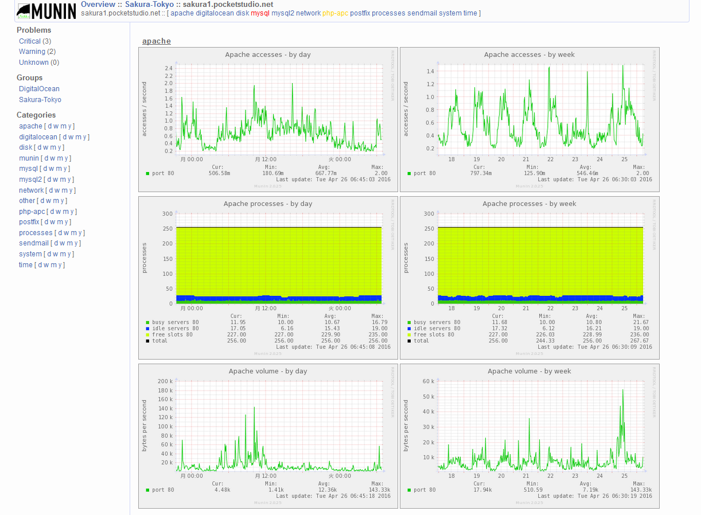

.. -*- coding: utf-8 -*-

=======================================
どうして Munin なのか？
=======================================

.. sidebar:: 目次

   .. contents:: 
       :depth: 3
       :local:

.. _why-munin:

リソース監視の必要性
====================

Munin はブラウザを通して様々なリソースを視覚化することができるツールです。リソース推移を監視するためのツールは Munin だけではありません。Zabbix [#zabbix]_ ・Cacti [#cacti]_ ・ Graphite [#graphite]_ ・Sensu [#sensu]_ ・ Mackerel [#mackerel]_ などのオープンソースのツールやサービスが提供されています。なぜ Munin のようなシステムのリソース監視が重要になってきているのでしょうか。

1990年台後半からインターネットは広く世界に普及を続け、今日では重要な社会インフラの１つという地位を占めつつあります。この成長にあわせ、インターネットで利用されるサーバも多く普及しはじめます。しかし90年代後半は、今日のように回線帯域は広くありませんでした。ISDNの64kbpsという速度でも十分速いと言われていたものです。また常時接続も当たり前ではなく、定額接続サービスと言えば、夜間から早朝まで一定額のテレホーダイ程度しか選択肢がありませんでした。

この頃もサーバに対する監視は存在していましたが、今で言う死活監視というレベルのものが殆どでした。死活監視とは、予め決めておいた閾値を超過すると障害発生と監視システムが判断し、メールで障害発生を通知したり、パトランプが点等したりして運用担当者に通知するものです。そして、規定の手順に従った調査・復旧対応を行います。おそらく今でも、多くの環境で死活監視が広く行われていると思います。

そして2000年台に入り、携帯電話とブロードバンドと呼ばれる広帯域回線の普及・低価格化によって、一気に状況が変わってきます。また常時接続も一般化し、ソーシャル・ネットワーキング・サービス（SNS）の普及により、インターネットと私達の生活がリンクするようになってきました。

そうなりますと、予測できない状況が多く発生し始めます。１つは、サービス提供事業者が想定していないアクセスの急増です。SNSを通して拡がる情報は、事業者再度では完全にコントロールができない場合があります。特に、アプリやゲームと呼ばれる分野では、アクセス急増でサービス障害が発生し、事業上の大きな機会損失を発生させてしまいます。

トラブルの発生による金銭的・社会的な機会損失できるだけ避けるため、障害が発生する、あるいは問題が起こりそうな状況になりますと、迅速な状況調査と回復が必要になります。まずサーバにSSH等でリモートログインし、サーバの中でコマンドの実行や、ログ調査といったトラブルシューティングを行い復旧を目指すことになります。しかし、サーバ台数が増えた場合は、ログインするだけで時間がかかりがちです。ログイン先の情報を確認し、認証を経て、ようやくログインするには慣れていてもある程度の時間を必要とします。

更に、システム環境もより複雑なものになります。サーバ環境はかつての物理サーバだけでなく、仮想化技術やクラウド・コンピューティング技術を用いた仮想サーバも普通に利用されるようになりました。最近ではコンテナ技術を使ったものも登場し始めています。

また、様々なミドルウェアやアプリケーションが利用されるようになり、トラブル時の原因切り分け（インフラ側か、OS側か、ソフトウェアかの判断）を求められるようになりました。このようにサーバ環境の複雑化や、システムの変化が進む中で、サーバに対する監視手法もスピードに対する変化を求められるようになります。

この答えの１つがリソース監視であり、サーバやネットワーク上のリソースを監視し、時系列グラフで把握できるようにする考えです。人間がグラフを見ることで、瞬間的に状況を把握し、どのようにすべきかという判断をサポートできるようになりました。

このリソース監視を手軽に導入でき、手軽に扱うことができる監視ソフトウェアがMuninです。Muninが監視できるのはOS上のリソース状況（CPU使用率、メモリ使用率、ディスク使用率、ネットワーク通信量）だけではありません。それに加えて、アプリケーションやミドルウェアが持つ様々な情報を取得し、時系列グラフを自動的に作成します。

.. rubric:: 脚注

.. [#zabbix] Zabbix http://www.zabbix.com/jp/
.. [#cacti] Cacti http://www.cacti.net/
.. [#graphite] Grahite http://graphite.wikidot.com/
.. [#sensu] Sensu http://sensuapp.org/
.. [#mackerel] Mackerel https://mackerel.io/ja/

